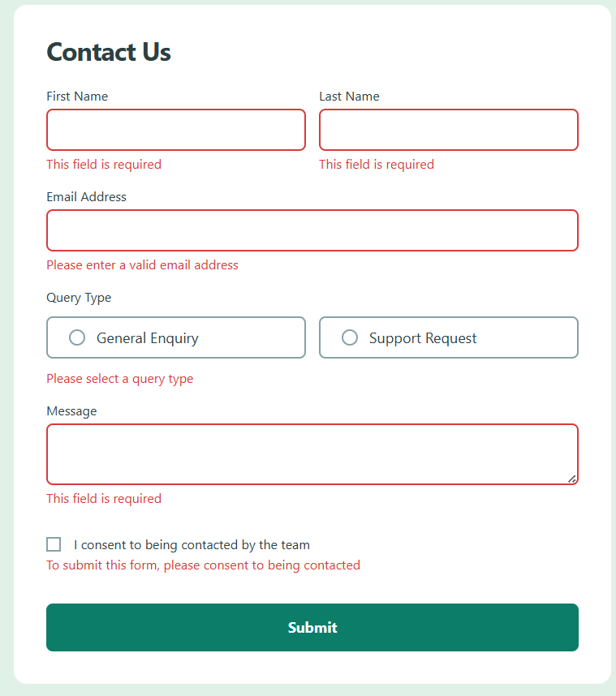
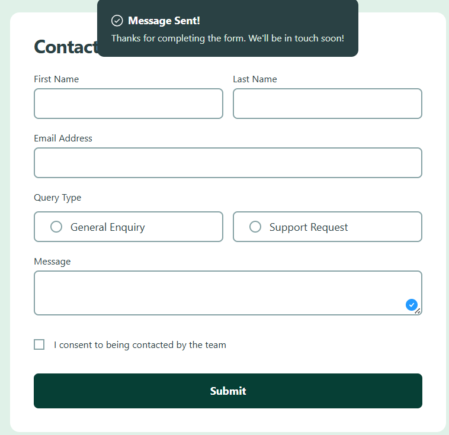

# 📌 Contact Form

## 📝 Descripción  
Este proyecto es un reto de **Frontend Mentor** donde construí un **formulario de contacto responsive** con validaciones nativas del navegador. El objetivo fue replicar el diseño en **mobile y desktop**, manejar el envío del formulario y mostrar una **notificación de éxito** al enviarse correctamente.

---

## 📸 Capturas de pantalla

### 💻 Vista Desktop

### ❌ Vista Error

### ✅ Vista Enviado

---

## 🛠 Tecnologías utilizadas
- React
- Vite
- Tailwind CSS
- JavaScript
- HTML5
- CSS (custom properties y estilos globales)
- ESLint

---

## 🚀 Retos
- Dividir el formulario en **componentes reutilizables** para mantener el código limpio y escalable.  
- Controlar el **estado de envío** para mostrar y ocultar la notificación usando `useState` y `useEffect`.  
- Aplicar validaciones visuales combinando **validación nativa del navegador** con utilidades de Tailwind (`peer`, `user-invalid`).

---

## 📚 Aprendizajes
- Aprovechar la validación HTML para reducir lógica innecesaria en JavaScript.  
- Mejorar la organización del proyecto usando componentes pequeños y enfocados.  
- Implementar una notificación temporal controlada por estado en React.

---

## 👨‍💻 Autor
**Jesus Anguiano**
